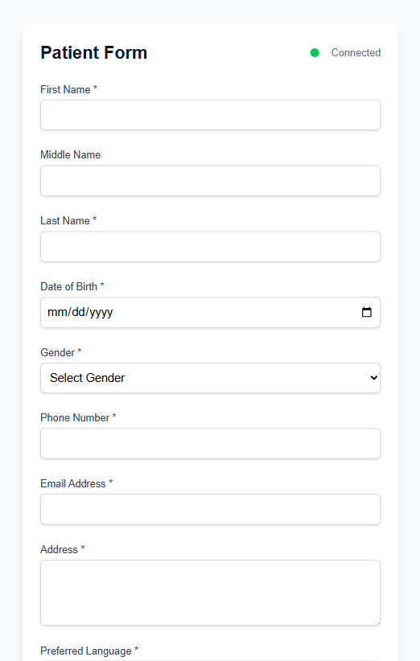

# Agnos Patient realtime monitoring

This project is a responsive web-based form designed for patients to submit their personal information. The submitted data is displayed in real-time to staff members through a dedicated interface. Staff can also monitor the activity status of each patient—whether they are active or inactive. The user interface is fully responsive and optimized for use across all device screen sizes.

## To run project
```bash
git clone https://github.com/MarkMPW/patient-realtime-monitoring.git

npm install

npm run dev

```

## Tech Stacks
* React 19
* Next.js 15
* TailwindCss
* TypeScript
* Ably
* Zod

> ### ❗️NOTES❗️
> ### Root page will render patient form, for staff go to /staff path

## Features
- **Real-time Data Sync**: Staff can instantly view patient data while typing without needing to refresh the page.
  
- **Activity Status Tracking**: Visual indicators show whether a patient is currently active or inactive or already sunmited the form.
  
- **Resposive Design**: Fully optimized for all screen sizes from mobile phones to desktop displays.
  
- **Validation and Type Safety**: Built-in form validation and schema enforcement using Zod and TypeScript.

## Setup Ably API Key
Before connect to Ably you need to create Api key first [Learn more](https://ably.com/docs/auth)
```
ABLY_API_KEY=
```

## Project Structure

```
patient-realtime-monitoring/
├── app/ # Next.js app directory
│ ├── api/ # API routes
| |  | └── ably-token/ # Ably authentication endpoint
| |  | | └── route.ts # Ably token generation
│ ├── staff/ # Staff-related page
│ ├── layout.tsx # Root layout component
│ ├── page.tsx # Patient page
│ └── globals.css # Global styles
│
├── components/ # Reusable React components
│ ├── PatientForm.tsx # Patient form component
│ ├── StaffView.tsx # Staff view component
│ └── Input.tsx # Reusable input component
│
├── hooks/ # Custom React hooks
│ └── useAbly.tsx # Ably real-time communication hook
│
├── interfaces/ # TypeScript interfaces/types
│
├── lib/ # Utility functions and configurations
│
├── public/ # Static assets
│
└── [Configuration Files]
├── package.json # Project dependencies
├── tsconfig.json # TypeScript configuration
├── next.config.ts # Next.js configuration
└── eslint.config.mjs # ESLint configuration
```

## Main Components
- **PatientForm.tsx**  
  - Maintains a responsive grid layout  
  - Collects patient information  
  - Sends real-time updates as the form is filled  
  - Tracks patient activity status (active/inactive)

- **StaffView.tsx**  
  - Displays patient data in real-time  
  - Highlights patient activity status  
  - Provides an interface for staff to monitor form submissions
    
## Real-Time Synchronization Flow
### 1. Connection Setup
- The application uses Ably's Realtime client for real-time communication
- Connection is established through a custom hook `useAbly`
- Authentication is handled via `/api/ably-token` endpoint

### 2. Channel Management
- Uses a dedicated channel named "patient-form" for patient data
- Channel is created and managed through the `useAbly` hook
- Connection state is monitored with `connected` and `disconnected` events

### 3. Real-time Updates Flow
#### Patient Side:
1. **Form Updates**
   - Every input change triggers a real-time update
   - Data is published to the "patient-update" event
   - Activity status is updated to "active" to the "activity-status" event

2. **Activity Monitoring**
   (useEffect)
   - Activity status is checked every 30 seconds
   - After 2 minutes of inactivity, status changes to "inactive"
   - Status is published to "activity-status" event

3. **Form Submission**
    - On successful submission:
      
        - Validated data is published to "patient-submit" event
        - Activity status changes to "submitted"
        - Staff is notified in real-time
          
#### Staff Side:
- Receives real-time updates through the same channel
- Can monitor:
  
  - Live form updates as patients type
  - Patient activity status
  - Form submission notifications

## Design

### Patient view

#### Desktop (Patient)


#### Mobile (Patient)


### Staff View

#### Desktop (Staff)


#### Desktop (Staff)


